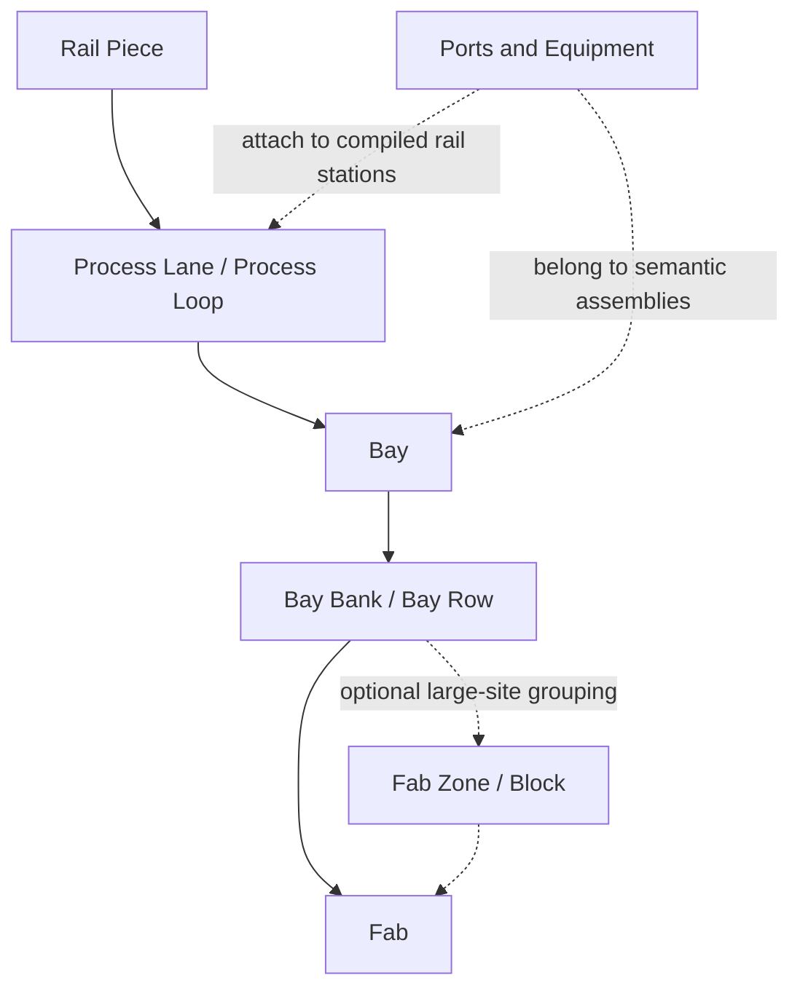
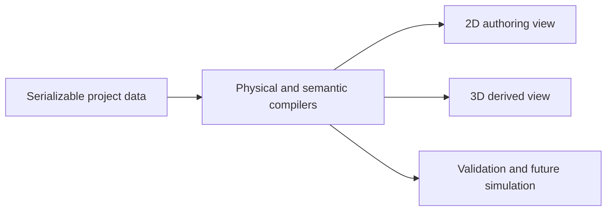

# OpenFab FAB Layout Grammar

> Status: independent OpenFab design baseline
>
> Scope: static 2D FAB layout authoring and its derived 3D inspection view
>
> Non-goal: reproducing any customer, employer, or proprietary FAB layout

## 1. Purpose

This document defines the semantic and geometric grammar used to build a FAB in OpenFab. It
corrects an earlier terminology error: a small closed rail loop is not, by itself, a **Bay**.

OpenFab uses this hierarchy:

```text
Rail Piece
  -> Process Lane / Process Loop
    -> Bay
      -> Bay Bank / Bay Row
        -> Fab

Optional large-site grouping: multiple Bay Banks may be grouped into a Fab Zone/Block, but that
group is not required by the baseline authoring flow and is never inferred from a small loop.
```

A Bay is a large production-area assembly. At minimum it contains:

- one large enclosing Bay circulation route, optionally with an internal collector;
- one or more long internal Process Loops or compatible Process Lanes;
- explicit directed connections between the internal routes and the Bay circulation;
- space and attachment surfaces for equipment, stockers, OHBs, and their ports.

The hierarchy is not a visual naming convention. It is an authored semantic structure with explicit
ownership, connection contracts, parameters, validation, selection, persistence, and derivation
rules.

## 2. Design Basis and IP Boundary

### 2.1 Permitted observations

This grammar is independently derived from:

- two user-provided screenshots showing generic, large-scale FAB characteristics;
- the public video [Unified Digital Twin Platform for Semiconductor Fab](https://youtu.be/xyJpLSr2dsE),
  which demonstrates an integrated facility-layout, production, and material-handling visualization
  workflow;
- OpenFab's existing public-safe 1 m directed TileMap and compiled physical-path rules.

The references support only general observations:

- FAB layouts are hierarchical and much larger than a collection of small loops;
- long, repeated process-rail structures dominate the production floor;
- shared interbay corridors and outer circulation connect those repeated structures;
- equipment and stations are spatially related to rail, but are separate authored entities;
- 2D authoring, 3D inspection, object selection, transforms, hierarchy, and property inspection must
  operate over one coherent digital-twin model.

The public video was inspected at both its plan-layout and 3D-facility sequences. It reinforces a
workflow requirement rather than a visual asset requirement: users author rails, machines, stockers,
and logistics objects in a precise plan workspace, then inspect the same authored facility in 3D.
OpenFab therefore keeps 3D read-only at this gate and derives it from the canonical project snapshot;
the video is not a source for geometry, assets, topology, dimensions, or implementation code.

### 2.2 Prohibited derivation

OpenFab MUST NOT encode or reproduce:

- a customer or employer layout, coordinates, dimensions, names, equipment counts, or topology;
- proprietary map files, algorithms, model assets, screenshots, or internal terminology;
- a traceable transformation of a confidential map;
- source-specific IDs or identifiers that imply an internal system.

Templates and presets MUST be generated from OpenFab-owned parameters and rules. Reference images
may influence the level of hierarchy and the category of repeated structures, but not their exact
arrangement.

## 3. Normative Language

The words **MUST**, **MUST NOT**, **SHOULD**, **SHOULD NOT**, and **MAY** are normative.

- **MUST** defines a data, topology, safety, or product invariant.
- **SHOULD** defines the default authoring behavior and may be overridden only by an explicit expert
  operation with visible validation.
- **MAY** defines an optional representation or workflow.

## 4. Coordinate and Geometry Foundation

### 4.1 Authoring lattice

- The canonical authoring plane is X/Z.
- Authored rail occupies a sparse **1 m cardinal grid**.
- Primary rail directions are `+X`, `-X`, `+Z`, and `-Z`.
- A normal construction gesture MUST resolve to the grid before it changes project data.
- Free-angle or free-spline rail MUST NOT be part of the baseline FAB grammar.
- Straight authored runs MAY be grouped by the compiler into physical pieces of at most 5 m.
- Standard cardinal turns use the project-owned R500 physical profile.
- The authored grid defines connectivity. Compiled physical geometry defines centerlines, tangents,
  lengths, clearances, and rendering.

### 4.2 Directed topology

Every rail connection is directed. A legal authored transition MUST satisfy all of the following:

1. The outgoing side of one cell is the matching incoming side of its adjacent cell.
2. A physical side cannot carry opposite directions at the same level.
3. Ordinary degree-two cells contain one incoming and one outgoing side.
4. A turn is tangent-continuous in compiled physical geometry.
5. A branch or merge retains one straight-through trunk and one curved diverging route.
6. A head-on planar T junction is illegal.
7. A planar X crossing is illegal unless a future explicit grade-separated primitive owns the two
   independent levels.
8. A committed route cannot overlap an existing route in the reverse direction.

### 4.3 Three geometry layers

OpenFab MUST keep three layers distinct:

| Layer | Responsibility | Source of truth |
|---|---|---|
| Authored topology | Tile occupancy, directed sides, module intent | Serializable project data |
| Compiled physical path | R500 curves, leads, tangents, distances, clearance | Derived from authored topology |
| Presentation | 2D stroke, arrows, 3D rail mesh, LOD | Derived from compiled geometry |

Presentation MUST NOT introduce connectivity or geometry that is absent from the compiled physical
path.

## 5. Semantic Hierarchy



### 5.1 Rail Piece

#### Definition

A Rail Piece is the smallest user-recognizable construction unit. It owns one atomic authored
intent, although it may span multiple cells or compile into more than one physical segment.

#### Required piece families

- straight run;
- left/right R500 quarter turn;
- tangent branch;
- tangent merge;
- U-turn;
- lateral shift;
- approved multi-input/multi-output switch module.

#### Parameters

| Parameter | Meaning | Constraint |
|---|---|---|
| `entry` | Directed boundary station | Grid-aligned |
| `exit` | Directed boundary station | Grid-aligned |
| `headingIn` | Incoming cardinal tangent | Required |
| `headingOut` | Outgoing cardinal tangent | Required |
| `lengthCells` | Authored straight extent | Positive integer |
| `turnProfile` | Physical curve profile | Approved catalog profile |
| `side` | Left/right branch or shift side | Explicit |
| `flow` | Directed traversal | Never inferred from screen orientation alone |

#### Invariants

- A piece MUST expose typed boundary stations rather than arbitrary endpoints.
- Placement MUST be atomic, undoable, and mirrored to the Worker.
- Rotation is in 90-degree increments.
- Flow reversal is separate from geometric rotation or mirroring.
- Invalid overlap, crossing, clearance, or tangent continuity MUST be rejected before commit.

### 5.2 Process Lane

#### Definition

A Process Lane is a long directed route serving one side or one traversal of a process area. It is
not required to be closed by itself. It commonly provides repeated port attachment stations along
one or both sides.

#### Parameters

| Parameter | Meaning |
|---|---|
| `axis` | Dominant X or Z axis |
| `runLength` | Length along the dominant axis |
| `flow` | Positive or negative axis direction |
| `portSides` | Left, right, both, or none relative to flow |
| `portPitchPolicy` | Manual, repeated pitch, or mixed |
| `entryContract` | Required incoming boundary station |
| `exitContract` | Required outgoing boundary station |

#### Invariants

- A Lane MUST have one dominant cardinal axis.
- Lane endpoints MUST remain open only when owned by an incomplete parent assembly or explicitly
  marked as construction terminals.
- Ports attach to compiled station coordinates and lateral sides, not merely to screen pixels.
- A Lane MAY be copied independently, but its open boundary contracts remain visible until resolved.

### 5.3 Process Loop

#### Definition

A Process Loop is a closed, directed, elongated circulation formed from two or more Process Lanes
and return geometry. It is a reusable production-rail primitive, not a Bay.

Typical abstract structure:

```text
outbound long lane  =====================>
                                         ) directed return
inbound long lane   <=====================
```

#### Parameters

| Parameter | Meaning |
|---|---|
| `length` | Long-axis extent |
| `laneSpacing` | Separation between outbound and return lanes |
| `returnStyle` | End return, offset return, or approved compound return |
| `flowSense` | Clockwise or counterclockwise in plan view |
| `serviceSides` | Port-bearing sides of the loop |
| `attachmentSites` | Typed branch/merge sites offered to the parent Bay |

#### Invariants

- A standalone Process Loop MUST form one directed strongly connected component.
- Its return geometry MUST use legal curves; square visual corners are not topology.
- At least one typed attachment pair SHOULD be reserved for integration into a Bay.
- Attachment sites MUST define both outbound transfer and return merge behavior.
- A Process Loop MUST NOT be labeled or presented as a Bay.

### 5.4 Bay

#### Definition

A Bay is the smallest complete production-area assembly presented to users as a FAB building block.
It combines a large enclosing Bay circulation envelope with one or more long internal Process
Loops. Each Process Loop may itself be assembled from paired Process Lanes. The default production
profile and its paired-circulation infrastructure are specified in
[`paired-circulation-fab-grammar.md`](./paired-circulation-fab-grammar.md).

A Bay therefore has two distinct rail roles:

1. **Bay circulation**: the large enclosing or collecting directed route that distributes traffic
   across the Bay;
2. **internal process circulation**: repeated, elongated routes adjacent to process equipment and
   ports.

#### Minimum composition

```text
+------------------------------------------------------------------+
|                  BAY CIRCULATION / COLLECTOR                      |
|   +---------------- Process Loop A ---------------------------+   |
|   +---------------- Process Loop B ---------------------------+   |
|        optional Process Loop C ...                                |
+------------------------------------------------------------------+
       ^ entry contract                          exit contract ^
```

The diagram is semantic, not a prescribed shape or scale.

#### Parameters

| Parameter | Meaning | Rule |
|---|---|---|
| `processLoopCount` | Number of internal loops | Integer, minimum 1; baseline catalog supports 1 or 2 |
| `processAxis` | Dominant orientation of internal loops | X or Z |
| `processLength` | Common nominal long-axis extent | Positive grid extent |
| `processPitch` | Center spacing between internal loops | Must satisfy clearance |
| `bayMargin` | Clearance from internal content to Bay circulation | Non-negative, validated |
| `circulationFlow` | Direction around Bay circulation | Explicit |
| `internalFlowPattern` | Flow assignment across loops | Explicit, deterministic |
| `entryAdapter` | Parent-to-Bay inbound connector contract | Required for placement |
| `exitAdapter` | Bay-to-parent outbound connector contract | Required for placement |
| `equipmentZones` | Port/equipment attachment bands | Derived and editable |
| `serviceVoidZones` | Reserved non-rail corridors | Optional but explicit |

#### Ownership

- The Bay owns its Bay circulation, internal Process Loops/Lanes, internal adapters, and optional
  ports/equipment included in the assembly.
- A route shared by multiple Bays MUST be owned by their Bay Bank or an explicitly authored optional
  Fab Zone, not duplicated into each Bay.
- Visual containment alone MUST NOT create ownership.
- Every child has exactly one direct structural parent. Cross-cutting semantic groups such as process
  family MAY overlap through separate organization records.

#### Connectivity invariants

1. Every internal Process Loop MUST connect to the Bay circulation through a legal directed
   outbound/return pair or an approved switch subgraph.
2. Internal loops MUST NOT be joined by head-on T junctions or planar crossings.
3. The Bay's rail subgraph SHOULD be one directed strongly connected component when detached as a
   complete standalone assembly.
4. An attachable Bay MAY expose unresolved parent terminals, but its internal circulation MUST
   remain complete.
5. Parent entry and exit contracts MUST identify direction, tangent, reserved footprint, and allowed
   connection class.
6. A Bay cannot be validated solely because its outer route is closed; every internal route must be
   reachable from and able to return to the Bay circulation.

#### Terminology correction

Existing or legacy small-loop motifs SHOULD be renamed in user-facing UI as one of:

- `Process Return Loop`;
- `Dual Process Loop`;
- `Offset Process Loop`;
- `Loop Connector`.

They MUST NOT be presented as `Long Bay`, `Paired Bay`, `Nested Bay`, or similar Bay-scale names
unless the composition satisfies this section.

### 5.5 Bay Bank / Bay Row

#### Definition

A Bay Bank or Bay Row is a repeatable arrangement of multiple Bays along shared interbay
infrastructure.

- **Bay Row** emphasizes a single linear sequence.
- **Bay Bank** may contain two opposing or parallel Rows and their shared collector/spine.

#### Parameters

| Parameter | Meaning |
|---|---|
| `bayCount` | Number of Bay children |
| `rowCount` | One or more parallel Rows |
| `bayPitch` | Repetition pitch along the bank axis |
| `bankAxis` | Dominant X or Z axis |
| `sharedSpineOffset` | Distance from Bay boundaries to the shared interbay spine |
| `flowPolicy` | Alternating, mirrored, or common Bay flow assignment |
| `gatewayPolicy` | End, midpoint, distributed, or explicit gateways |
| `expansionEnds` | Ends reserved for future Bay repetition |

#### Ownership and invariants

- The Bank owns the shared spine, shared collectors, and Bank-level gateways.
- Child Bays own only their non-shared content.
- Each Bay MUST have at least one legal directed ingress and one legal directed egress to Bank-owned
  circulation.
- Repetition MUST preserve Bay pitch, clearance, and connector compatibility.
- Appending or removing a Bay MUST be one parameterized command, not a blind geometric scale.
- Bank resizing changes repetition count, pitch, or Bay parameters. It MUST NOT stretch R500 curves
  or distort physical profiles.
- A Bank MAY expose typed expansion terminals, but unexplained open endpoints are invalid.

### 5.6 Optional Fab Zone / Block

#### Definition

A Fab Zone/Block is an optional macro organization made from multiple Bay Banks plus zone-level
interbay or perimeter circulation. It can support very large sites, large-scale duplication, and
independent validation, but it is not required to create a valid Fab and is hidden from the baseline
construction palette.

#### Parameters

| Parameter | Meaning |
|---|---|
| `bankCount` | Number of contained Bay Banks |
| `bankArrangement` | Parallel, opposing, staggered, or explicit grid |
| `zoneInterbay` | Shared Zone spine/cross-spine specification |
| `zonePerimeter` | Optional Zone circulation envelope |
| `zoneGateways` | Typed links to Fab circulation |
| `processFamilies` | Optional semantic labels independent of geometry |
| `reservedCorridors` | Service, safety, or future-expansion voids |

#### Invariants

- Every Bank MUST reach a Zone gateway through directed shared infrastructure.
- A Zone SHOULD provide more than one route between high-level circulation and its Banks when the
  selected topology class requires operational redundancy.
- Zone circulation and child circulation MUST have explicit ownership boundaries.
- Zone duplication MUST remap all IDs, preserve internal references, and expose fresh gateway
  contracts.
- Shared infrastructure cannot be silently absorbed into the first or nearest Bay.

### 5.7 Fab

#### Definition

A Fab is the project-level AMHS layout composed of one or more Bay Banks, optional Fab Zones,
global interbay spines, global outer circulation, gateways, static equipment, and semantic
organizations.

The baseline large-FAB grammar supports:

- a global outer circulation envelope;
- one or more central or cross interbay spines;
- repeated Bay Banks with long internal process structures;
- optional explicitly authored Zones grouping Banks at unusually large sites;
- explicit cardinal gateways between Banks or Zones, spines, and outer circulation;
- reserved areas for service, expansion, and non-AMHS infrastructure.

It does not require every Fab to be a perfect rectangle or every Bank to be identical.

#### Parameters

| Parameter | Meaning |
|---|---|
| `bankLayout` | Grid, linear, mirrored, zoned, or explicit Bank composition |
| `outerEnvelope` | Global circulation shape and margin |
| `spineLayout` | Central, cross, multi-spine, or explicit network |
| `gatewaySet` | Directed Bank-or-Zone/spine/outer connections |
| `globalFlowPolicy` | Deterministic direction assignment |
| `expansionZones` | Reserved future Zone or Bank areas |
| `organizationTree` | Area, Bay, aisle, and process-family metadata |

#### Completion invariants

A Fab is statically complete only when all of the following are true:

1. There are no unexplained rail terminals.
2. All required parent/child boundary contracts are resolved.
3. The directed network passes the selected reachability policy.
4. The physical rail network is connected according to the authored semantic hierarchy.
5. No illegal X crossings, head-on T junctions, reverse overlaps, or unsupported junctions exist.
6. Compiled physical geometry passes clearance and footprint validation.
7. Every port references a valid physical route and station.
8. Every equipment group has reciprocal, valid port membership.
9. Structural ownership has no orphan, duplicate, or cyclic parent relationships.
10. Project persistence, undo/redo, and Worker mirror checksums agree.

Static completion does not enable OHT simulation. Simulation readiness is a later, stricter gate.

## 6. Boundary Contracts and Composition

### 6.1 Typed boundary station

Every reusable assembly exposes zero or more boundary stations:

```ts
type LayoutBoundaryStation = Readonly<{
  id: string;
  role: "INGRESS" | "EGRESS" | "EXPANSION";
  x: number;
  z: number;
  heading: "+X" | "-X" | "+Z" | "-Z";
  connectionClass: "LANE" | "BAY" | "BANK" | "BLOCK" | "FAB";
  clearanceClass: string;
}>;
```

This is a conceptual contract, not a required immediate TypeScript API.

### 6.2 Compatibility

Two boundaries are compatible only when:

- one is an egress and the other is an ingress, or both participate in an approved paired adapter;
- headings and approach geometry can be joined by legal tangent-continuous rail;
- connection classes are equal or an explicit adapter supports the pair;
- reserved footprints do not collide;
- the connection does not create reverse overlap, planar crossing, or forbidden topology;
- the prospective directed and physical networks pass validation.

Nearness alone is never a valid connection rule.

### 6.3 Attach versus merge

- **Attach** places a child assembly and constructs an adapter between compatible parent and child
  boundaries.
- **Merge** reuses already occupied same-direction rail only when the full physical path, ownership
  policy, and boundary contract agree.
- Partial visual overlap MUST be shown as invalid rather than silently welded.
- A valid ghost MUST show the exact rails that will be reused, added, and reserved.

### 6.4 Closed and open authoring states

Assemblies may be in one of three states:

| State | Meaning | Commit policy |
|---|---|---|
| `COMPLETE` | Internal and parent-required contracts resolved | Normal |
| `ATTACHABLE` | Internally valid with explicit parent terminals | Normal with visible terminals |
| `DRAFT` | Contains unresolved or invalid structure | Editable, cannot pass completion gate |

An open endpoint is acceptable only when represented by an explicit boundary contract or active
construction draft.

## 7. Parameterized Assembly Rules

### 7.1 No affine rail scaling

Rail assemblies MUST NOT be resized by applying a visual affine scale. Resizing changes semantic
parameters and regenerates the affected authored topology:

- straight lengths gain or lose whole grid cells;
- repeated child counts change discretely;
- pitches change in whole-grid increments;
- curves retain their approved physical profile;
- adapters are re-planned against current boundaries;
- ports and equipment either move by an approved rigid transform or require explicit reassignment.

### 7.2 Parameter dependency order

Assembly generation SHOULD resolve parameters in this order:

```text
physical profile constraints
  -> child Process Loop geometry
  -> Bay internal pitch and margins
  -> Bay circulation envelope
  -> Bay Bank pitch and shared spine
  -> optional Fab Zone/Block gateways and corridors, when explicitly authored
  -> Fab outer/spine network
  -> port/equipment attachment zones
```

A parent parameter cannot force a child to violate a lower-level physical invariant.

### 7.3 Determinism

Given the same grammar version, normalized parameters, seed, anchor, and pose, generation MUST
produce the same canonical project data and fingerprints.

### 7.4 Preset classes

The primary catalog SHOULD contain assemblies at the level users actually intend to place:

1. **Rail**: straight, curve, branch/merge, U-turn, shift, switch.
2. **Process**: long return loop, dual process loop, process-lane pair.
3. **Bay**: large Bay assembly with 1-2 internal long loops in the baseline catalog.
4. **Bank**: repeated Bays with shared interbay spine.
5. **Fab Starter**: multiple Banks, global spines, and outer circulation.
6. **Advanced Zone / Block**: optional grouping for unusually large sites; hidden from the baseline
   catalog.
7. **Blueprints**: user-authored mixed rail, port, equipment, and semantic assemblies.

Legacy synthetic motifs that do not satisfy the Bay definition SHOULD be hidden from the primary Bay
catalog or relabeled under Process.

## 8. Static Equipment and Port Relationship

### 8.1 Port-first authority

Ports are authored attachment records on physical rail stations. Equipment bodies are derived from
port groups and equipment metadata.

- An OHB normally owns one rail-side port.
- An EQ may own one or more contiguous or explicitly grouped ports.
- A Stocker may own flexible, nonuniform port runs, including opposing or back-to-back arrangements.
- Port spacing MUST NOT be globally forced to a single pitch.
- Equipment body geometry MUST NOT determine rail topology.

### 8.2 Bay equipment zones

A Bay SHOULD derive candidate equipment zones from:

- internal Process Lane station intervals;
- flow-relative rail sides;
- rail and equipment clearance;
- reserved maintenance and service voids;
- existing port and body occupancy.

Zones are placement guidance, not a second spatial source of truth. Final ports reference exact
compiled route stations.

### 8.3 Blueprint scope

A blueprint MAY contain:

- rail topology and advanced switches;
- ports and equipment groups;
- Bay/Bank/Fab organization records and optional authored Zone/Block records;
- internal parent-child relationships;
- named boundary contracts;
- parameter metadata needed for safe regeneration.

Runtime IDs, renderer objects, Worker state, and source-project ownership IDs MUST NOT be persisted in
a portable blueprint.

## 9. Editing UX

### 9.1 Tool hierarchy

The primary editor should expose four clear activities rather than a flat list of synthetic shapes:

1. **Build Rail**: draw or replace Rail Pieces and routes.
2. **Assemble**: place or configure Process, Bay, Bank, and Fab assemblies. Optional Zone/Block
   grouping belongs in an advanced secondary surface.
3. **Equip**: place ports and complete equipment groups.
4. **Select / Blueprint**: inspect, transform, duplicate, save, and reuse mixed content.

The current activity, pending command, boundary requirements, and validation result MUST remain
visible without opening a large modal.

### 9.2 Rail construction gesture

- LMB click or drag starts from the snapped grid station under the pointer.
- Drag resolves to a cardinal route with legal R500 transitions.
- Existing compatible rail magnetizes within a bounded screen-space radius.
- The ghost distinguishes added rail, reused rail, reserved clearance, and invalid cells.
- A route cannot begin from an arbitrary off-grid or visually displaced point.
- Consecutive direction changes continue to use legal curves; a previous curve does not disable the
  next turn.
- RMB drag pans the camera; RMB click or Escape cancels the active draft.
- Keyboard commands act on the pending asset, not the camera, while construction is active.

### 9.3 Assembly placement

Before commit, an assembly ghost MUST show:

- exact authored footprint;
- child hierarchy silhouette;
- ingress, egress, and expansion terminals;
- proposed adapters to nearby compatible rail;
- reused versus added rail;
- equipment and service exclusion zones;
- dimensions, child count, pitch, orientation, and flow;
- one concise reason for invalid placement and the nearest corrective action.

Assembly controls SHOULD support:

- 90-degree rotate;
- geometric mirror when the assembly permits it;
- flow reversal independent of rotation;
- discrete length, pitch, margin, and child-count changes;
- automatic nearest-compatible attachment;
- explicit selection of a different compatible boundary;
- repeat placement without reopening the catalog.

Changing a parameter MUST update the ghost in place. The pointer should not need to leave the canvas
and hide the ghost merely to compare variants.

### 9.4 Hierarchical selection

Repeated activation on the same location SHOULD cycle through:

```text
Rail Piece -> Process Lane/Loop -> Bay -> Bay Bank -> Fab
```

An explicitly authored optional Fab Zone/Block MAY appear between Bay Bank and Fab. It MUST NOT be
inferred or inserted into the baseline selection cycle.

The inspector MUST show the selected level, parent breadcrumb, child count, dimensions, connectivity,
and unresolved contracts. Users MUST be able to move from an issue to the exact affected entity and
back to its parent assembly.

### 9.5 Area selection and blueprints

- Shift + LMB drag selects rail, switches, ports, equipment, and semantic assemblies in an area.
- Selection is independent of whether its rail is closed or connected to the rest of the Fab.
- Copy captures an in-memory recent blueprint.
- Save creates a named persistent blueprint.
- Paste restores the most recent compatible blueprint ghost.
- Rotate, mirror, and flow-reverse operate on the ghost before placement.
- Placement SHOULD magnetize compatible boundaries and preview the resulting adapter before commit.
- A user blueprint library MUST support multiple saved records, folders/tags, favorites, import, and
  export through platform adapters.

### 9.6 Resize and repetition

Selection handles MUST map to semantic operations:

- dragging a Process Loop end changes its long straight extent;
- dragging Bay bounds changes margins, pitch, or child count according to the active handle;
- dragging a Bank repetition handle changes Bay count;
- dragging an explicitly authored optional Fab Zone/Block boundary changes corridor or Bank
  arrangement parameters;
- mouse wheel or keyboard steppers MAY adjust the active discrete parameter.

The UI MUST preview which children will be added, removed, or moved. It MUST NOT imply continuous
visual scaling.

### 9.7 Diagnostics

Diagnostics MUST use FAB-authoring language rather than graph-theory labels alone.

Bad:

```text
Directed SCC: 16 regions
```

Required form:

```text
Bay B-04 cannot return to its Bank spine.
The highlighted merge faces the wrong flow direction.
[Reverse Bay flow] [Choose another gateway] [Inspect merge]
```

Technical details MAY be shown in an expandable section. Automatic repair is allowed only when the
exact proposed mutation can be previewed and undone as one command.

## 10. Validation Model

### 10.1 Incremental placement validation

Pointer-time validation SHOULD be local and revision-bound:

- grid and boundary compatibility;
- occupancy and reserved footprint;
- tangent and direction continuity;
- local physical compilation;
- nearby clearance;
- parent ownership compatibility.

It MUST NOT recompute or rerender the whole Fab on every pointer move.

### 10.2 Assembly validation

On commit or explicit inspection, validate the selected semantic level:

| Level | Required checks |
|---|---|
| Rail Piece | directed adjacency, profile, occupancy, clearance |
| Process Loop | closure, one directed SCC, valid attachment pairs |
| Bay | 1+ internal loops, internal reachability, Bay circulation, parent contracts |
| Bay Bank | every Bay ingress/egress, shared-spine ownership, pitch and expansion ends |
| Optional Fab Zone/Block | every Bank reaches gateways, no duplicated shared infrastructure |
| Fab | global connectivity policy, terminals, physical clearance, ports/equipment, ownership |

### 10.3 Worker contract

Every authored mutation MUST be:

- represented as one serializable command or atomic command group;
- undoable and redoable;
- checked against the exact source revision;
- mirrored through the typed Worker patch protocol;
- acknowledged with matching project identity, sequence, and checksum;
- rejected without partial mutation when stale or invalid.

Large assembly planning and whole-Fab validation SHOULD run in disposable or dedicated Workers.
Pointer-time ghosts MAY use bounded coarse artifacts, but commit authority remains the exact planner.

## 11. Persistence and Identity

### 11.1 Serializable source of truth

The project data MUST contain only serializable domain records:

- directed TileMap topology;
- advanced rail modules and switches;
- ports and equipment groups;
- semantic assembly records and parent relationships;
- boundary contracts;
- parameters needed for deterministic regeneration;
- stable domain IDs and monotonic ID cursors.

Canvas objects, Three.js objects, React state, DOM references, spatial indexes, compiled paths, and
Worker handles are derived runtime data.

### 11.2 Semantic identity

Each assembly record SHOULD include:

```ts
type FabAssemblyRecord = Readonly<{
  id: string;
  kind: "PROCESS_LANE" | "PROCESS_LOOP" | "BAY" | "BAY_BANK" | "FAB_ZONE" | "FAB";
  parentId: string | null;
  name: string;
  childIds: readonly string[];
  ownedRailModuleIds: readonly string[];
  boundaryStationIds: readonly string[];
  parameterSet: Readonly<Record<string, number | string | boolean>>;
  grammarVersion: number;
}>;
```

This is a conceptual schema. Actual implementation may use normalized tables and typed columns, but
must preserve the same semantics.

### 11.3 Explicit versus derived hierarchy

- User-authored names, parent relationships, parameters, and blueprint boundaries are explicit.
- Bounds, silhouettes, physical lengths, station positions, clearances, and render meshes are
  derived.
- Geometry-based recognition MAY propose a hierarchy for legacy maps, but MUST NOT silently replace
  explicit ownership.

## 12. Derived 2D Presentation

At whole-Fab scale, detail must reduce by semantic level:

| Zoom level | Primary representation |
|---|---|
| Fab | outer circulation, spines, Bay Banks, major gateways |
| Optional Fab Zone | grouped Bay Banks, shared corridors, Zone gateways |
| Bay Bank | Bay envelopes, shared spine, flow direction |
| Bay | Bay circulation, internal Process Loops, equipment zones |
| Process | physical rail, switches, ports, clearance |

Direction MUST remain legible without drawing dense arrows on every meter:

- use sparse, zoom-stable chevrons on long tangent runs;
- use animated flow accents only for selected or inspected routes;
- use stronger entry/exit glyphs at assembly boundaries;
- suppress redundant markers at whole-Fab scale;
- preserve color contrast independently of motion.

Semantic bounds SHOULD be subtle bands or labels, not opaque cards over the map.

## 13. Derived 3D View

### 13.1 Single-model rule

The 3D view is a consumer of the same project data and compiled physical geometry as 2D. It MUST NOT
create a second editable rail map.



### 13.2 Required derivations

- Rail centerlines and tangents come from compiled physical paths.
- Rail mesh orientation follows path tangents and elevation metadata.
- Curves use the same physical profiles as 2D.
- Equipment bodies derive from equipment metadata and port groups.
- Port markers remain independently inspectable.
- Bay, Bank, and Fab hierarchy, plus any explicitly authored optional Zone, drives visibility,
  selection, isolation, and framing.
- Selection IDs are shared across 2D and 3D.

### 13.3 3D editing boundary

The initial 3D stage is inspection-first:

- orbit, pan, zoom, fit, and top/isometric views;
- hierarchy tree and search;
- object selection and property inspection;
- hide, isolate, and semantic LOD;
- issue highlighting;
- synchronized selection with 2D.

Later 3D editing MAY provide transform gizmos, multi-selection, alignment, equal spacing, and asset
placement. Those operations MUST dispatch the same domain commands used by 2D. A mesh transform may
never directly mutate authoritative geometry.

### 13.4 Performance requirements

- Static repeated equipment SHOULD use instancing or equivalent batching.
- Rail geometry SHOULD be chunked by spatial region and semantic level.
- Whole-Fab views SHOULD use semantic LOD and culling.
- A Worker SHOULD perform the full numeric artifact validation before transfer. The main thread MAY
  adopt the transferred artifact through a constant-field/type/length/ownership envelope check
  instead of rescanning every numeric element.
- Certified artifact bounds SHOULD seed renderer bounds directly; the renderer MUST NOT rescan
  million-vertex buffers merely to derive an already-certified box or sphere.
- Whole-Fab overview LOD MAY omit dual-beam detail and sample repeated supports/flow hardware while
  preserving complete canonical pick geometry and selection identity.
- Runtime geometry SHOULD use typed arrays or structure-of-arrays where appropriate.
- Selection and issue overlays SHOULD be separate from static geometry.
- Camera motion MUST NOT trigger React reconciliation of every rail or equipment entity.
- 2D and 3D caches MUST be revision-bound and disposable.

### 13.5 Visual hierarchy

At distant views, the user should first perceive:

1. Fab outer circulation and principal spines;
2. optional authored Zone boundaries and main gateways;
3. repeated Bay Banks and long process rows;
4. equipment density and service voids;
5. individual rails, ports, and equipment only when sufficiently close.

This avoids the false appearance that a FAB is merely a field of equally prominent small loops.

## 14. Canonical Authoring Flow

The default user journey is:

```text
place or draw Process Loops
  -> assemble 2+ loops inside a Bay circulation
  -> configure Bay dimensions, flow, ports, and attachment contracts
  -> repeat Bays into a Bay Row or Bank
  -> connect Banks through shared interbay circulation
  -> optionally group Banks into explicit Zones for a very large site
  -> close global outer circulation and gateways
  -> place and group ports/equipment
  -> validate static FAB
  -> inspect the same model in derived 3D
```

Users may enter at any level through a blueprint or preset, but the resulting data MUST satisfy the
same hierarchy and invariants.

## 15. Acceptance Examples

### 15.1 Valid Process Loop, invalid Bay label

A single elongated closed return loop is topologically valid as a Process Loop. It is invalid as a
Bay because it lacks a Bay circulation envelope and a complete internal process route.

### 15.2 Valid Bay

A large directed circulation contains three elongated Process Loops. Each loop has a tangent
outbound branch and return merge to Bay circulation. All routes are reachable and returnable, and
the assembly exposes one parent ingress/egress adapter pair. This is a Bay.

### 15.3 Invalid Bay

A large rectangle visually surrounds several loops, but one internal loop has no legal route back to
the rectangle. Visual containment does not satisfy Bay connectivity; the Bay remains a draft.

### 15.4 Valid Bay Bank

Several Bays repeat at a common pitch beside a Bank-owned interbay spine. Every Bay uses an explicit
directed adapter pair, and the Bank exposes expansion terminals at one end. This is an attachable Bay
Bank.

### 15.5 Invalid Fab

Multiple complete Bay Banks are visible inside a global rectangle, but one Bank is connected only
by a planar X crossing and another has no egress. The drawing looks enclosed, but it is not a
complete Fab.

## 16. Implementation Sequence

This grammar implies the following implementation order without changing the product gate:

1. Correct user-facing names for existing small-loop motifs.
2. Introduce explicit Process Loop and real Bay assembly records and generators.
3. Add boundary contracts and hierarchy-aware ghosts.
4. Add Bay Bank repetition with shared-infrastructure ownership.
5. Add Fab composition from public-safe Bay Bank, spine, and outer-circulation parameters.
6. Make mixed-content blueprints preserve the hierarchy and contracts.
7. Complete port/equipment authoring against Process Lane stations.
8. Validate complete static FABs at every semantic level.
9. Add the derived 3D inspection view over the same data.
10. Implement simulation-readiness validation only after static authoring is complete.

## 17. Non-Goals

This grammar does not define:

- customer-specific layout import or conversion;
- OHT dispatch, routing, reservation, or collision behavior;
- production recipes, scheduling, or KPI models;
- a proprietary rail catalog;
- arbitrary free-angle rail;
- direct editing of a separate 3D map;
- one universal FAB shape.

Its purpose is to ensure that OpenFab's editor constructs a recognizable hierarchy of process
routes, Bays, Banks, optional large-site Zones, and whole Fabs without confusing a small closed loop
for a production Bay.
