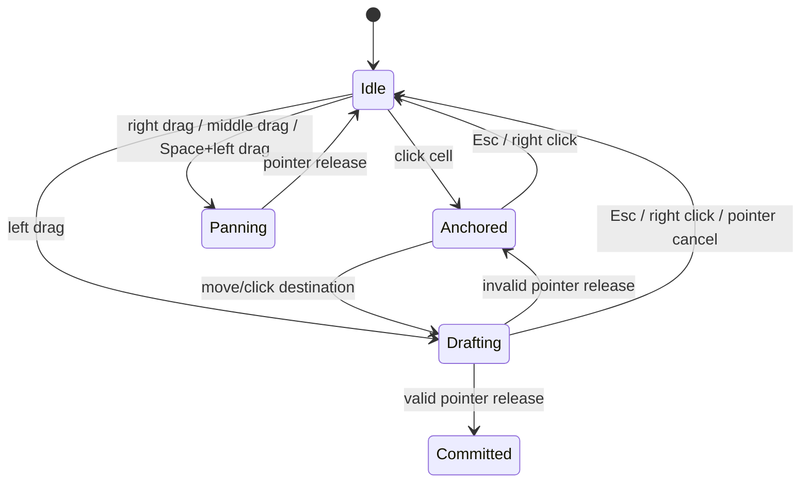

# FAB Rail Construction v3

> Active specification, updated 2026-07-19. Scope is rail construction only. Native project
> persistence and the port-first construction foundation are implemented; 3D, OHT vehicles,
> production simulation, and legacy map import remain gated by the authoritative static-authoring
> roadmap. Game-facing FAB pattern composition is the active rail acceptance extension.

Session continuation and the complete phase order are defined in [`HANDOFF.md`](./HANDOFF.md) and
[`static-fab-authoring-roadmap.md`](./static-fab-authoring-roadmap.md).
The actual Process Loop/Bay/Bank/Fab ownership vocabulary is defined in
[`fab-layout-grammar.md`](./fab-layout-grammar.md); this rail document must not relabel a small loop
as a Bay.

Physical rendering decisions and the shared Canvas/WebGL/3D path contract are specified in
[`physical-rail-renderer.md`](./physical-rail-renderer.md).
The live editor-to-worker replication contract is specified in
[`rail-worker-mirror.md`](./rail-worker-mirror.md).

## North star

Build a 2D AMHS rail editor with the immediacy of a transport/city-building game and realistic
directed FAB topology:

- the user works on a visible metric lattice;
- pointer gestures create modular, axis-aligned, directed rail;
- straight, curve, branch, merge, 180-degree, and offset patterns derive from the path;
- the preview is the exact proposed post-commit topology;
- invalid crossings and reverse overlaps are visible before release, while detached manual routes
  remain valid work-in-progress and are reported by whole-project readiness until connected;
- every gesture is atomic, cancelable, undoable, and suitable for worker replication;
- committed rail is a connected, closed directed system before simulation can start.

## Reference decisions

| Reference | Adopt | Do not adopt |
|---|---|---|
| [IsoCity](https://github.com/amilich/isometric-city) | Canvas layering, grid hit testing, viewport culling, revision caches | cloning and committing the whole tile grid for every drag cell; polygonal road corners |
| [OpenTTD Autorail](https://wiki.openttd.org/en/Manual/Building%20tracks) | directional drag construction, exact track removal, grid-first tool behavior | diagonal half-cell tracks before orthogonal AMHS rules are complete |
| [Factorio rail planner](https://wiki.factorio.com/Rail_planner) | persistent endpoint planner, ghost route, repeated continuation, cancel | unrestricted obstacle routing and rail geometry unrelated to AMHS |
| [Cities: Skylines II road tools](https://www.paradoxinteractive.com/games/cities-skylines-ii/features/road-tools) | snapping guides, route alternatives, right-click step cancellation, bulldoze/replace separation | arbitrary free spline as the default authoring mode |
| Shapez 2 (`docs/shapez2-codex.html`) | contextual input hints, area selection, repeat placement, blueprint library, rotate/mirror preview | visual copying, domain rules, or a second editable model |
| [Fab Tycoon](https://github.com/jhl-labs/fab-tycoon) | public-demo information architecture: central FAB workspace with stable contextual side panels | source/assets, management-first HUD, or visual copying; the public project is all-rights-reserved |

IsoCity is MIT licensed. The full upstream notice is retained in `THIRD_PARTY_NOTICES.md`.

## Metric grammar

- Authoring lattice: **1 m** cells.
- Major grid: **5 m**.
- Linear physical piece: compiler groups consecutive cells into **at most 5 m**.
- Standard 90-degree curve: **R500** quarter arc inside one 1 m cell.
- Authoring axes: world `(x, z)`, with positive `z` downward in the default top view.
- View rotation: 0/90/180/270 degrees; rotation never changes stored map coordinates.
- No diagonal/free-angle construction in v3.

The 1 m lattice and 5 m compiler boundary are intentionally different. Treating a whole 5 m module
as one visual cell produced R2.5 m road-like corners and did not match the project R500 vocabulary.

### Engineering constraints

Every legal incoming-to-outgoing transition is tangent-continuous at the shared physical station;
head-on T and same-layer planar crossing are invalid. Normal branch/merge degree is at most two in
and two out. The project turnout grammar uses symmetric `400 mm lead + R500 quarter arc + 400 mm
lead` geometry for branch and merge. Quarter, half, S, and CSC compounds use the project-owned R500
cardinal-grid catalog; fitted variants retain explicit signed residual metadata.

This establishes two distinct layers: the 1 m tile graph is the construction grammar, while the
compiled physical edge owns millimeter-scale lead, radius, arc, and direction-tangent geometry.

## Canonical model

One byte stores each rail cell:

```text
bits 0..3  incoming ports  N E S W
bits 4..7  outgoing ports  N E S W
```

The map is a sparse `32 x 32` chunk grid of `Uint8Array` values. Adjacency alone has no meaning. A
directed path command adds paired ports to consecutive cells. This permits adjacent parallel rails
without merging them.

### Invariants

1. Every directed edge is represented on both adjacent cells: outgoing on the source, incoming on
   the target.
2. The same physical side cannot be both incoming and outgoing in one cell.
3. Degree one is an open terminal.
4. Degree two must be one incoming and one outgoing: straight or R500 curve.
5. Degree three must be `1 -> 2` branch or `2 -> 1` merge.
6. Degree four is a planar crossing and is rejected.
7. A degree-three junction must retain one directed straight-through trunk. The third port joins by
   a curve; head-on T layouts such as `N+S -> W` or `E -> N+S` are rejected.
8. An ordinary Smart Route may start on any empty cell. Separate authored components are valid
   work-in-progress; the completed-layout readiness gate, not the drawing gesture, requires final
   connectivity.
9. Reverse-direction overlap on an occupied physical rail is rejected.
10. A simulation-ready layout has no open terminals and is strongly connected in both traversals.

These rules define directed edges, regular `1/1` nodes, `1/2` branches, `2/1` merges, and no
geometric straight-through crossing without an explicit logical node or layer distinction.

## Construction planner

A drag creates two candidate Manhattan paths:

- `X -> Z`
- `Z -> X`

`AUTO` validates both and selects the valid candidate with the lowest topology cost. At an open
endpoint it first prefers the existing travel direction, preventing the next chained drag from
making an unexpected immediate turn. The user can lock either route order from the segmented
control or cycle it while drafting.



The first click renders a point handle, not a fake horizontal rail. Successful open construction
keeps the destination as the next active anchor. Completing a closed loop clears that anchor.

### Contextual replacement handles

Inspect mode exposes only edits that preserve a bounded directed boundary:

- a regular corner replaces the corner and its 3 m approach arms;
- an open terminal keeps a fixed connection 3 m inside the network and reroutes the endpoint;
- a regular straight keeps fixed cells 3 m before and after the selection, then moves the enclosed
  7 m run perpendicular to its axis through two dogleg transitions and four R500 corners.

The original graph stays committed while the pointer moves. A mutation-overlay planner renders the
exact replacement as a green/red ghost; click commits one `edit` patch. Occupied replacement lanes,
junction supports, inconsistent direction, and insufficient straight support are rejected before
commit. Escape or right-click restores the original selection without creating history.

## Atomic command boundary

The planner returns a pure proposal:

```ts
interface RailConstructionPlan {
  baseRevision: number;
  cells: readonly Cell[];
  mutations: readonly { x: number; y: number; before: number; after: number }[];
  valid: boolean;
  conflicts: readonly Cell[];
}
```

`RailDocument` commits the complete patch or nothing, records one history entry per gesture, and
emits a revisioned patch event. Undo uses the exact inverse values; redo reapplies the original.
Every event is now mirrored to a real module worker. The worker verifies epoch, sequence,
base/final revision, unique cells, and exact before-values before applying the patch, then returns an
incremental graph checksum. The bridge snapshot-recovers automatically on a rejected patch. Editor
UI code never mutates a cell or posts an ad hoc worker message directly.

## Visual language

- neutral cleanroom grid with distinct 1 m and 5 m hierarchy;
- subtle occupied-cell envelopes;
- a construction bed with two procedural carrier-beam faces, center slot, and diagnostic centerline;
- R500 quarter arcs with tangent continuity at cell boundaries;
- gold modular joints plus neutral, dark-outlined direction chevrons;
- amber open-terminal rings;
- straight trunk plus curved diverging route for branches and merges;
- green valid tile corridor, red invalid corridor, explicit conflict cells;
- start/end handles and metric/curve count readout at the pointer;
- selected-cell outline and compact rail inspector.

No decorative map, equipment, ports, or vehicles are rendered during the rail-only milestone.

## Physical rail compiler

The authoring model is deliberately smaller than the physical rail vocabulary. The compiler derives
catalog-backed pieces:

| Pattern | Output | Physical rule |
|---|---|---|
| consecutive straight cells | `LINEAR` | chunks no longer than 5 m |
| one orthogonal turn | `LEFT_CURVE` / `RIGHT_CURVE` | R500, screen-style `+z` turn sign |
| adjacent equal-direction turns | `CCW_CURVE` | catalog R500/180-degree profile |
| adjacent opposite turns | `S_CURVE` | catalog R600/50-degree S profile, grid-fitted when needed |
| equal turns with exactly one straight between | `CSC_CURVE_HOMO` | catalog R500 homogeneous CSC |
| opposite turns with exactly one straight between | `CSC_CURVE_HETE` | catalog R500 heterogeneous CSC |

Compound candidates are collected before singleton emission and walked in directed source order.
North/west flow, reverse map insertion order, and overlapping five-curve chains therefore compile to
the same flow-ordered `cells/from/to` metadata. Authored tile grammar remains separate from physical
geometry: the compiler records the selected project catalog profile and every grid-fit residual
instead of relabeling a 1 m footprint as an exact physical edge.

Detected compounds are then stitched into one continuous metric path. The physical SoA stores
separate entry and exit authored cells, while `coverageOffsets/coverageCells` keeps every consumed
tile addressable for hover, selection, culling, and deletion. Primary topology indices are remapped
before turnout records are emitted, so adjacency advances from the compound exit cell. A
within-revision CSR partitions raw routes into final stitched paths. A second cross-revision CSR
composes matching raw route intervals in canonical physical station so OHT state can survive final
path index shifts, compound merge/split, and turnout support changes. Ghost compilation uses the
same stitcher as committed rendering.

Branches and merges compile as junction records plus an exact trunk and diverging physical piece.
They are not planar cross pieces. Each junction records its directed trunk, diverging side, tangent
side, asymmetric lead-in/out, R500 radius, three-cell reservation, and compiled path indices.
Compilation also reports missing straight supports, overlapping turnout footprints, invalid cells,
and non-reciprocal neighbor ports instead of silently dropping malformed geometry. The compiler is
revision driven and can be moved behind the worker protocol without changing the editor command
surface.

## Rendering and performance

- Committed grid and rails render into a revision/camera-keyed lower DOM canvas.
- Ghost, hover, anchor, selection, and downstream flow render into a transparent upper DOM canvas.
- Pointer frames clear only the upper canvas; they never copy a full-DPR committed raster with
  `drawImage`.
- Static redraws are coalesced with `requestAnimationFrame`.
- Physical path AABBs are indexed in sparse 32 m chunks backed by `Uint32Array` buckets. Static
  redraws query only intersecting chunks and then apply an exact AABB test.
- Tangent-continuous metric runs own repeated, hardware-aware direction markers. Short curves,
  U-turns, shifts, turnouts, switches, and closed loops retain at least one marker without restoring
  authored-cell seams.
- The source map uses chunked typed arrays and does not allocate React elements per cell.
- Replacement planning uses a mutation overlay over the source map. Corner, terminal, and straight
  candidates touch only their bounded edit corridor, never clone authored chunks, and preserve the
  same directed boundary nodes.
- React state is updated for commands and coarse HUD state, not every canvas segment.

The automated frame-budget harness indexes 50,000 compiled paths and queries a viewport without a
full-path scan. Separate 50,000-cell reshape and compound-module fixtures prove that unrelated chunks
do not affect the planned patch or force a whole-document topology analysis. A 10,000-unrelated-path
fixture also verifies compound stitching stays linear and preserves total metric length.

## Input contract

| Input | Action |
|---|---|
| Left drag | build or bulldoze with current tool |
| Inspect left drag | select every semantic rail module intersecting the area |
| Left click | set construction anchor or select one module/port with inspect tool |
| U-TURN / SHIFT then endpoint + side click | place an exact compact or 2 m CSC compound module |
| Right click | cancel current draft/anchor |
| Right drag | pan |
| Middle drag / Space+left drag | pan |
| Wheel | cursor-anchored zoom |
| WASD / arrows | screen-space pan |
| Q / E | rotate the active template/stamp; otherwise choose the active module side or Smart Route bend order |
| [ / ] | change the active pre-placement pattern dimension by its exact catalog step |
| Tab / Shift+Tab | cycle the active pre-placement pattern dimension |
| Cmd/Ctrl+Z, Shift+Cmd/Ctrl+Z | undo, redo |

The visible UI uses icons and tooltips; this table is documentation, not an in-app instruction panel.

## Acceptance status

### Implemented and tested

- [x] sparse typed directed-cell map with negative coordinate support;
- [x] explicit adjacency, no accidental parallel-track merge;
- [x] atomic build/erase patches with stale-revision check plus worker-facing sequence and base/final
  revisions;
- [x] exact undo/redo and undoable clear;
- [x] straight, repeated 90-degree curve chaining, branch, and merge;
- [x] smooth direction-aware turnout rendering;
- [x] tangent turnout grammar: straight trunk plus one curved branch/merge, with head-on T rejection;
- [x] disconnected ordinary-route authoring with whole-project connectivity diagnostics, while
  reverse overlap and planar crossing remain rejected;
- [x] closed-loop and directed strong-connectivity analysis;
- [x] click anchor plus repeated drag continuation;
- [x] right-click/Escape/pointer-cancel cancellation;
- [x] hover, selection, selected-module delete, and continue-from-selection;
- [x] branch/merge-aware bypass deletion that preserves the main trunk;
- [x] selected-corner reshape with atomic subpath replacement and closed-loop preservation;
- [x] directed endpoint relocation with a fixed 3 m network boundary, hover ghost, exact undo, and
  start/end terminal orientation tests;
- [x] horizontal/vertical straight offset handles with 7 m bounded replacement, four automatic
  R500 corners, collision rejection, closed-loop preservation, and exact undo;
- [x] replacement planning remains local with 50,000 unrelated cells, and all replacement commits
  use the existing typed worker `edit` patch channel;
- [x] browser hand test: straight offset kept `CLOSED LOOP`, changed `52/52 cells/edges` to `56/56`,
  then undo restored the exact graph; endpoint move kept two open ends and worker `MIRROR READY`;
- [x] browser straight-ghost probe: final topology preview reported `10 m · 4 curves`; three pointer
  moves inside one cell changed overlay redraws `18 -> 21` while static redraws `6`, physical
  bindings `5`, and ghost compiles `5` stayed fixed;
- [x] WASD/arrows and right/middle pan, cursor zoom, plus construction-context Q/E transforms that
  rotate the active template/stamp without rotating the map view;
- [x] stacked committed/overlay DOM canvases, revision cache, and no full-DPR pointer-frame blit;
- [x] browser layer probe: first-point selection changed redraws `static 2 -> 2`,
  `overlay 2 -> 3`; committing the route then changed the static layer;
- [x] browser pointer probe: three moves changed `overlay 32 -> 35` while `static 29` and physical
  binding count `2` stayed fixed;
- [x] browser culling probe: panning changed visible candidates `9 -> 0` while committed physical
  paths stayed `9`; fit-to-map restored candidates to `9`;
- [x] sparse 32 m physical-path spatial index with reusable query/stamp buffers;
- [x] 50,000-path index/query frame-budget regression test;
- [x] local mutation-overlay corner reshape with a 50,000 unrelated-cell regression test;
- [x] typed worker snapshot plus transferable patch SoA for sequenced
  build/edit/erase/undo/redo/clear mirroring;
- [x] main/worker incremental graph checksum acknowledgement and epoch-based desync recovery;
- [x] transactional worker-owned physical layout publication with logical-revision stamping,
  path/profile/remap/turnout fingerprint telemetry, exact sequence/revision ACK gates, and rollback
  on physical compiler failure;
- [x] collision-free signed-int32 directed raw-route identity plus canonical-station previous-to-next
  migration CSR with explicit deleted/unmappable intervals, 50,000-route budget coverage, and atomic
  `delta(previous,current,migration)` worker publication bound by sequence/revision/fingerprint;
- [x] browser worker probe: build `sequence 1 / revision 9`, then undo/redo/clear acknowledgements at
  `2/18`, `3/27`, and `4/36`, with the empty checksum restored after clear;
- [x] 50,000-cell typed-grid iteration and bounds regression test;
- [x] catalog `LINEAR`, left/right curve, CCW, and S-curve recognition;
- [x] direction-order-invariant `CSC_CURVE_HOMO/HETE` recognition with atomic middle-cell
  consumption, exact physical length, broken-seam rejection, and overlapping-chain precedence;
- [x] endpoint-owned `U-TURN` and `SHIFT` build modes with left/right pointer intent, compact/2 m CSC
  spacing, exact ghost, collision rejection, undo, and 50,000-cell locality;
- [x] compound builds use the existing typed worker `build` patch; browser probes confirmed
  `CCW_CURVE 1.57 m` and `CSC_CURVE_HETE 2.57 m` with `MIRROR READY` after commit;
- [x] compound same-cell pointer probe changed overlay redraws `11 -> 14` while static redraws `4`,
  physical bindings `2`, and ghost compiles `3` remained fixed;
- [x] revision-driven typed physical path SoA with positions, tangents, cumulative distances,
  bounds, explicit entry/exit cells, source-cell coverage, and shared-hardware intervals;
- [x] CCW/S/CSC authored modules stitched into one multi-cell physical path with seam de-duplication,
  primary topology remapping, interval-state remapping, turnout fallback, and exit-cell adjacency;
- [x] catalog-backed `MAP_EXACT/GRID_FIT` metadata with nominal IDs, complete signed residuals,
  semantic control stations, and monotonic source-path CSR remaps;
- [x] compound coverage remains selectable from every consumed authored cell and direction markers
  are distributed at two metric fractions of the stitched path;
- [x] browser compound-path probe: `9 authored cells / 8 edges` compiled to `8 physical paths`;
  selecting either curve cell reports the same fitted logical piece;
- [x] project-owned catalog profiles are derived from R500 cardinal geometry with symmetric 500 mm
  compound leads; compact S and U-turn modules are `MAP_EXACT`, while larger boundaries retain
  explicit `GRID_FIT` residuals without changing endpoints or tangents;
- [x] exact R500 path sampling for both turn directions in all four orientations;
- [x] committed Canvas rail rendered from compiled physical paths with tangent-aligned arrows;
- [x] top-down 230 mm profile treatment with chamber/slot and explicit turnout blade;
- [x] 10,000-cell physical-path compilation regression fixture;
- [x] latest-cell-only rAF planning and local exact physical ghost compilation;
- [x] browser cache probe: multi-point 8 m drag compiled one ghost buffer; three hover moves changed
  overlay redraws `18 -> 20` while static redraws, physical bindings, and ghost compiles stayed fixed;
- [x] browser hand test: three-drag loop, branch/merge bypass, crossing conflict, selection/delete/undo.
- [x] stable advanced-switch sidecar with four explicit `K2,2` movements, A-D catalog provenance,
  whole-footprint ownership, atomic build/erase/reshape/undo/redo/clear, and no degree-four crossing;
- [x] A-D remote compounds compile for every quarter-turn/chirality into a deterministic five-path
  synthetic subgraph with movement-path and conflict-interval CSR, explicit
  `400 + 200 + 400 mm` shared-support ownership, and no baseline fallback;
- [x] advanced-switch snapshot/patch SoA, incremental authored checksum, complete physical
  fingerprint, path migration boundary, malformed-buffer rejection, and 50,000-cell locality;
- [x] advanced-switch Canvas ghost and committed rendering share the physical compiler, use a
  revision-cached 32 m switch index, select/erase the whole identity, and expose explicit OUT 1/OUT 2
  continuation;
- [x] browser advanced-switch probe: CLASS A build, OUT 1 extension, stable `SW-1` A-to-B reshape,
  undo/redo, whole erase/restore, Q/E, WASD, and right-click cancel all retained `MIRROR READY` with
  `simulationReady=false`; 390x844 and 844x390 inspector layouts remained operable.
- [x] project-owned beam/OHT/installation capsule envelopes, exact closest-contact validation,
  relationship ownership, deterministic stable-identity issues, Worker byte reconstruction, and
  50,000-envelope sparse broad phase;
- [x] one revision-cached local `RailDraftEvaluator` for route, fixed module, edit, and advanced
  switch preview/commit, with stale rejection, exact cyan/red installation corridors, topology plus
  physical conflict cells, and no Canvas-side ghost compilation.
- [x] frozen project-owned construction catalog and core dispatcher for Smart Route, U-turn, shift,
  and advanced switch, with declared grammar/options/applicability/repeat behavior, catalog-driven
  responsive controls, anchor state telemetry, and browser straight-to-U-turn construction coverage.
- [x] compile-side selected-piece resolver for route/compound/turnout/switch catalog presets, with
  exact compound span and switch class/chirality recovery, synthetic switch-leg rejection, inspector
  setting-copy activation, and browser compact U-turn selection/copy coverage.
- [x] authored semantic ownership index for deterministic 1-5 m straight, R500, U-turn, shift,
  turnout, and advanced-switch modules; edge-exclusive 5/5/3 partitioning; copied chirality default
  with pointer override; physical-route turnout hit selection; whole-module highlight; directed-edge
  exact bulldoze; stale physical/key rejection; and shared Main/Worker switch boundary preservation.
- [x] interval-exact ordinary-turnout clearance ownership with full trunk/diverge geometry, three
  directed boundary stations, compound `exitCells` support, speculative cross-layout endpoint checks,
  sparse intersecting-compound draft expansion, legal-lead/direct-abut distinction, all 16
  branch/merge rotation-side cases, and Worker CSR forgery/corruption rejection.
- [x] renderer-independent semantic module stamp templates with exact entry/junction/switch-input
  anchors, four quarter-turn poses, explicit AUTO/LEFT/RIGHT side commands, span/profile and metric
  grammar preservation, whole-footprint cyan/red preview, repeat policies, exact overlap/terminal/
  turnout/switch guards, one undo command, and one typed Worker patch per accepted placement.
- [x] renderer-independent physical presentation with stable path identity, typed point normals,
  metric runs, true 5 m joints, visual supports, circular closed-loop exclusion, and deterministic
  flow markers that cannot disappear on a short run.
- [x] default paired-beam Canvas profile plus hardware-free diagnostic centerline mode; one redraw
  reuses center/left/right `Path2D`, while hover, pan, mode switch, and ghost frames preserve the
  revision-bound presentation build count.
- [x] paired valid/invalid physical ghosts, exact physical hover, metric semantic-module selection,
  turnout-lead station slicing, local selection candidates, interaction `Path2D` caches, and frozen
  flow/hover/selection/ghost/handle/label/conflict precedence.
- [x] straight, turn, compact/wide U-turn and shift, branch, merge, and A-D switch selected-module
  rendering across all four camera rotations and overview/construction/detail LODs, with targeted
  hover, ghost, conflict, and cache-invalidation regressions.
- [x] real-editor 10k/50k development fixtures with fixed-memory render/Long Task/heap telemetry;
  steady-state interactions remain local with revision-bound physical presentation.
- [x] disposable Worker-first startup with transferable authored/ownership/physical/render/draft
  buffers, cooperative main-thread fingerprint verification, mirror-ACK-gated atomic activation,
  latest-wins cancellation, rollback, and automated production 10k/50k acceptance with zero Long
  Tasks.
- [x] copy-on-write authored map generations and snapshot-derived post-command Worker activation for
  10k/50k maps; real 5 m build, undo, and redo keep main-thread dispatch below 50 ms, activation
  slices below 8 ms, checksum/fingerprint identity exact, and Long Tasks at zero while the existing
  mirror Worker remains authoritative.
- [x] ten project-owned parameterized compatibility templates: Open-End Return; attachable Return;
  legacy `Long/Paired/Nested/Shift Bay` IDs now treated as Process Loop motifs; N-loop interbay
  spine; outer-circulation starter; and attachable outer-circulation link. They are not the public
  Bay definition, which requires a large circulation envelope plus at least two Process Loops.
  Four rotations, explicit chirality, transformed occupied/reserved footprints, fingerprints,
  full cyan/red ghosts, one undo event, and one typed Worker patch remain shared. Attach patterns
  prove tangent branch/merge SCC preservation on an existing directed trunk.
- [x] categorized `CLOSED/ATTACH/CONNECT` pattern browser, blueprint-derived directional miniatures,
  construction-context Q/E transforms, north-up project view normalization, and zoom-stable directed
  terminal closure magnet with overlay-only target rendering.
- [x] runtime-proven repeatable closed motifs, temporary disconnected closed work-in-progress,
  compatible same-direction overlap, exact duplicate rejection, and existing parent-loop reuse.
- [x] install-time exact-dimension steppers plus `[`/`]` and Tab controls. Wheel remains zoom and
  post-placement resize is reserved for a future topology-preserving structural replace command.
- [x] revision-bound cyan/red attachment intervals compile from one pose-relative footprint, compress
  a 50k-cell trunk, and leave final topology/clearance acceptance to the shared draft evaluator. One
  immutable 16-pose index resolves nearest-axis pointer focus without rescanning authored rail.
- [x] Inspect left-drag rectangle selection resolves semantic ownership only on pointer release;
  one atomic bulldoze preserves boundary edges, handles switch sidecars, rejects port orphans, and
  mirrors as one typed Worker patch.
- [x] A complete closed semantic selection can be captured as a transient exact Area Stamp without
  persisting pattern provenance. Exact selected directed edges rotate by quarter turns, reverse flow
  independently from geometry, repeat only on empty rail cells, and commit through one ordinary
  evaluator/history/Worker build command. Capture is synchronously bounded to 2,000 edges, and an
  occupied destination still compiles the exact proposed physical geometry for its red ghost.
  Cut-open selections and advanced-switch ownership remain explicit v1 rejections.
- [x] Free-closed Area selections derive transient catalog identity and integer parameters by exact
  directed-edge comparison. Equivalent pose aliases fold into one candidate; semantically different
  identical geometries remain explicit ambiguity, and custom loops remain supported Area Stamps.
- [ ] A recognized candidate can replace its own selected edge graph through one atomic in-place
  structural `edit`; affine Canvas scaling and delete/rebuild history remain prohibited.
- [x] Pattern placement assessment combines typed core planning, physical evaluation, port validity,
  and revision identity. Canvas renders transformed entry/exit/origin handles and exact hard-
  reservation bounds; a ref-driven contextual panel updates without React pointer-state churn or
  committed-layer redraws. Parameter-only blueprints use a bounded immutable LRU, while each pointer
  position still receives a fresh transformed plan and full physical evaluation. Local physical
  layouts retain a WeakMap source identity outside serializable data, compiler faults receive a typed
  preview-error state, and the non-interactive panel exposes no stale accessible description.
- [x] atomic Network Link authoring selects parallel straight runs on two closed directed components,
  previews separately colored OUTBOUND and RETURN routes with four exact branch/merge boundaries,
  and commits both routes through one evaluator decision, undo command, and Worker patch. Smart Route
  rejects a hidden one-way component bridge. A current exact one-way readiness corridor may be
  converted to the same link as one atomic `edit`; stale, ambiguous parallel, unsupported,
  port-orphaning, or physically invalid candidates preserve the original graph.
- [x] active product boundary cleanup removed the retired free-spline, R3F, procedural-Bay,
  import-first, and premature OHT implementations plus stale source-specific documentation and
  packages. `src/tilefab/**` is the only authored map architecture.
- [x] versioned rail-project readiness binds authored checksum and physical fingerprint, validates
  authored/physical SCCs, terminals, unsupported junctions, topology, and clearance, and exposes
  bounded issue navigation without a second editable model. Its presentation guide separates the
  first repair from dependent checks, explains the next concrete edit, navigates complete typed
  location buffers, and traces exact one-way corridors with OUT/IN boundaries rather than presenting
  arbitrary SCC cells as faults. The deterministic 129-cell Phase 1 fixture plus actual desktop/
  narrow browser construction, invalid crossing, reshape, undo/redo, Worker ACK, and 10k/50k gates
  complete rail-only exit acceptance with `simulationReady=false`.

### Rail-only work remaining

The graph, physical compiler, editor command, persistence, readiness, and scale baseline is complete.
Atomic two-way component linking and exact one-way bridge conversion are complete. User acceptance
keeps the final game-facing pattern composition surface open for:

- catalog-pattern recognition from selected directed edges plus one-command topology-preserving
  structural resize with explicit ambiguous/unsupported outcomes;
- card miniatures derived from compiled physical geometry rather than authored-cell polylines;
- starter plus multiple attachments, save/load, narrow viewport, and scale browser acceptance.

Phase 3 port-first construction remains implemented and preserved. The 2026-07-19 correction added
explicit EQ anchored/ready/blocked feedback and safe FLEX STK groups with odd, asymmetric one/two-lane
station sets, continuous-rail proof, preflight body-clearance feedback, canonical persistence, and
atomic Worker validation. Committed FLEX bodies occupy interactive OHB/EQ/STK preview space, and
hover, aggregate drag, and sparse-span checks retain the exact conflicting group ID. Readiness
issues now expose one root repair plus dependent checks, exact location/path tracing, and direct
repair actions instead of raw SCC labels. EQ/STK group relocation and duplication resume after this
pattern gate. 3D and OHT vehicle work remain later gates.
